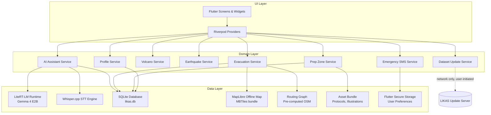

# Design Document: LIKAS Disaster Companion

## Overview

LIKAS is an offline-first, AI-powered disaster companion mobile application for Filipino communities. It transforms a smartphone into a self-contained survival tool by bundling all critical data — maps, evacuation centers, fault lines, ashfall zones, disaster protocols, and a quantized language model — within the application package at install time.

The application is built with **Flutter** (targeting Android 10+ / iOS 15+) to maximize code reuse across platforms while enabling deep native integration for on-device AI inference. The centerpiece is an **Always-On AI Assistant** powered by **Gemma 4 E2B** (2-billion-parameter edge model, 4-bit quantized, ~2.58 GB) running via **Google AI Edge's LiteRT-LM** runtime through the `flutter_gemma` plugin. Every feature — maps, routing, protocols, checklists, and AI — operates with zero network dependency at runtime.

### Key Design Decisions

| Decision | Choice | Rationale |
|---|---|---|
| Mobile framework | Flutter | Single codebase for Android + iOS; strong plugin ecosystem for LiteRT, maps, and SQLite |
| On-device LLM | Gemma 4 E2B via LiteRT-LM | ~2.58 GB at 4-bit quantization; fits within 3 GB RAM budget; multilingual (Filipino/English); supported by `flutter_gemma` |
| Offline maps | MapLibre Native (`maplibre_gl`) | Vendor-neutral, open-source, supports bundled MBTiles vector tiles; no API key required |
| Routing engine | Pre-computed pedestrian graph (Dijkstra over OSM data) | Valhalla/GraphHopper are too large to bundle; a pre-processed routing graph for Philippine disaster-prone areas fits within the storage budget |
| Local database | SQLite via `sqflite` | Mature, cross-platform, supports geospatial queries via R-tree extension |
| On-device STT | Whisper.cpp (base multilingual model) via FFI | Fully offline; supports Filipino and English; ~150 MB model size |
| State management | Riverpod | Compile-time safe, testable, no BuildContext dependency |
| Local persistence | SQLite (structured data) + Flutter Secure Storage (preferences) | Separation of concerns; secure storage for user preferences |

---

## Architecture

LIKAS follows a **layered, offline-first architecture** with strict separation between the UI, domain logic, and data layers. All data flows are local — no network calls are made during normal operation.



### Offline-First Guarantee

The architecture enforces offline operation through three mechanisms:

1. **No ambient network client**: The app contains no HTTP client calls during normal operation.
2. **Bundled assets**: All map tiles (MBTiles), model weights (`.litertlm`), routing graph, and protocol content are packaged as Flutter assets.
3. **Local-only data stores**: SQLite and Flutter Secure Storage are the only persistence mechanisms.

---

## Components and Interfaces

### 1. AI Assistant Service

Manages the LiteRT-LM inference session and conversation state.

```dart
abstract class AIAssistantService {
  /// Loads the Gemma 4 E2B model into the LiteRT-LM runtime.
  Future<void> initialize();

  /// Immediately returns the first actionable safety step for a context.
  /// e.g. "DROP, COVER, AND HOLD ON!" for Earthquake.
  String getImmediateAction(DisasterContext context);

  /// Returns suggested quick-reply chips based on context.
  List<String> getContextualChips(DisasterContext context);

  /// Submits a text query and streams the response.
  Stream<String> query({
    required String userMessage,
    DisasterContext? context,
    List<ChatMessage> conversationHistory,
  });

  bool get isReady;
}
```

### 2. Evacuation Service

Handles route calculation and ranking based on the **Scoring System**.

```dart
abstract class EvacuationService {
  /// Returns ranked evacuation centers based on UserProfile.
  /// Scoring factors: Distance, Capacity, PWD Access, Pet Friendliness.
  Future<List<EvacuationRanking>> getRankedCenters({
    required LatLng origin,
    required UserProfile profile,
    EvacuationType type = EvacuationType.typhoonFlood,
  });

  /// Returns the custom meeting places set during onboarding.
  List<MeetingPoint> getMeetingPoints();
}

class EvacuationRanking {
  final EvacuationCenter center;
  final double score; // 0.0 to 1.0
  final bool isBestMatch;
  final EvacuationRoute route;
}
```

**Scoring Logic**:
- **Distance**: 40% weight (closer = higher score).
- **PWD/Elderly Match**: 30% weight (if profile has PWD/Elderly and center has facility).
- **Pet Match**: 20% weight (if profile has pets and center is pet-friendly).
- **Capacity**: 10% weight (higher capacity = higher score).

### 3. Profile Service

Manages user data entered during the 5-screen onboarding.

```dart
abstract class ProfileService {
  Future<UserProfile> getProfile();
  Future<void> updateProfile(UserProfile profile);
  Future<void> saveEmergencyContacts(List<Contact> contacts);
}

class UserProfile {
  final String name;
  final String ageGroup;
  final Dependents dependents;
  final List<String> healthConditions;
  final LocationPreference location;
}
```

### 4. Emergency SMS Service

Triggers the platform-native SMS intent with pre-formatted emergency data.

```dart
abstract class EmergencyService {
  /// Formats and opens the SMS intent with:
  /// "SOS! I am at [Lat, Long]. [Name] needs help. [Context] emergency."
  Future<void> triggerSOS({
    required LatLng location,
    required UserProfile profile,
    String? disasterContext,
  });
}
```

---

## Data Models

### SQLite Schema

```sql
-- User Profile (New)
CREATE TABLE user_profile (
    id          INTEGER PRIMARY KEY,
    name        TEXT NOT NULL,
    age_group   TEXT NOT NULL,
    infants     INTEGER DEFAULT 0,
    children    INTEGER DEFAULT 0,
    elderly     INTEGER DEFAULT 0,
    pwd_count   INTEGER DEFAULT 0,
    has_pets    INTEGER DEFAULT 0,
    pet_details TEXT, -- JSON: {"dogs": 2, "cats": 1}
    primary_meeting_place   TEXT,
    secondary_meeting_place TEXT,
    lat_manual  REAL,
    lon_manual  REAL,
    barangay    TEXT,
    city        TEXT
);

-- Health Conditions (New)
CREATE TABLE user_health (
    profile_id INTEGER,
    condition  TEXT NOT NULL,
    FOREIGN KEY (profile_id) REFERENCES user_profile(id)
);

-- Emergency Contacts (New)
CREATE TABLE emergency_contacts (
    id    INTEGER PRIMARY KEY AUTOINCREMENT,
    name  TEXT NOT NULL,
    phone TEXT NOT NULL
);

-- Evacuation centers (Updated with flags)
CREATE TABLE evacuation_centers (
    id          TEXT PRIMARY KEY,
    name        TEXT NOT NULL,
    address     TEXT NOT NULL,
    latitude    REAL NOT NULL,
    longitude   REAL NOT NULL,
    capacity    INTEGER,
    facility_type TEXT NOT NULL,
    disaster_types TEXT NOT NULL,
    is_pwd_friendly INTEGER DEFAULT 0,
    is_pet_friendly INTEGER DEFAULT 0
);
```

### Asset Bundle Structure

```
assets/
├── model/
│   └── gemma4-e2b-it-q4.litertlm       # Gemma 4 E2B (~2.58 GB)
├── maps/
│   └── philippines-disaster-zones.mbtiles  # Vector tiles (~800 MB)
├── first_aid/
│   ├── illustrations/                  # Large, clear icons for injuries
│   └── protocols.json                  # Numbered steps for first aid
├── protocols/
│   └── labels/                         # Multi-language strings for Dashboard
└── db/
    └── likas_seed.db                   # Pre-populated with PHIVOLCS/PAGASA data
```

---

## Correctness Properties

### Property P13: Scoring System Accuracy
*For any* user profile and origin, if the user has `has_pets == 1`, the `EvacuationRanking` for a pet-friendly center SHALL have a higher `score` than a non-pet-friendly center at the same distance.

### Property P14: Emergency SMS Generation
*For any* call to `triggerSOS`, the resulting message string SHALL contain the substring "SOS", the user's name, and the decimal coordinates (latitude/longitude).

### Property P15: Battery-Aware Mode Transition
*Whenever* the device battery level reported by the platform channel is < 15%, the UI SHALL display a low-power warning and the `AIAssistantService` SHALL refuse generative inference.

### Property P16: Dashboard Immediate Action Latency
*Whenever* a "Big Button" is tapped, the `getImmediateAction` response SHALL be rendered in the UI within 500ms, regardless of whether the LiteRT model has finished loading.

---

## Testing Strategy

### Onboarding & Profile Tests
- Verify Screen 1-5 transitions.
- Verify that data entered in onboarding persists after app restart (Property P8).
- Verify that "Best Match" badges update correctly when dependents are changed in Settings.

### Dashboard & SOS Tests
- Mock battery levels to trigger P15.
- Verify SOS message formatting matches P14.
- Verify "Big Buttons" correctly set the `DisasterContext`.

### Prep Zone & First Aid Tests
- Verify search functionality in First-Aid library.
- Verify visual progress bar calculation (packed / total items).
- Verify that large fonts/high contrast meet WCAG 2.1 AA (Requirement 10.5).

### Performance Benchmarks
| Metric | Target |
|---|---|
| Dashboard Big Button -> First Step | < 0.5 seconds |
| SOS Button -> SMS Intent open | < 1 second |
| First-Aid screen render | < 1.5 seconds |
| Evacuation ranking (100 centers) | < 1 second |
