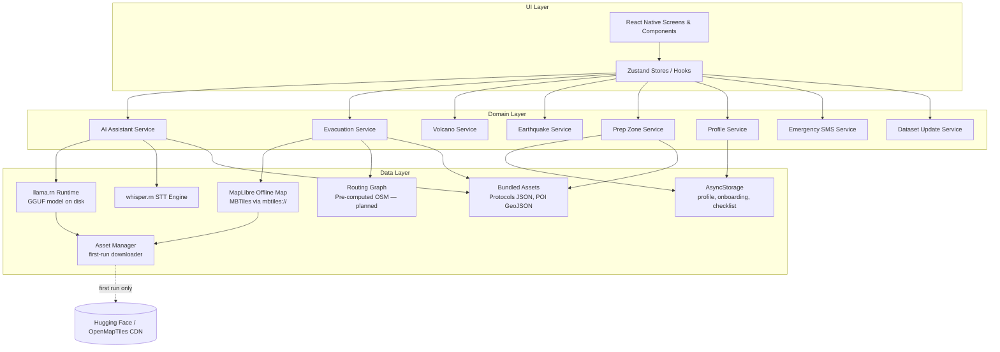

# Design Document: LIKAS Disaster Companion

## Overview

LIKAS is an offline-first, AI-powered disaster companion mobile application for Filipino communities. It transforms a smartphone into a self-contained survival tool by bundling all critical data — maps, evacuation centers, fault lines, ashfall zones, disaster protocols, and a quantized language model — within the application package at install time.

The application is built with **React Native** (targeting Android 10+ / iOS 15+) to maximize code reuse across platforms while enabling deep native integration for on-device AI inference. The centerpiece is an **Always-On AI Assistant** powered by **Gemma 4 E2B** (instruction-tuned, Q4_K_XL GGUF, ~3.2 GB) running via **`llama.rn`**, React Native bindings to `llama.cpp`. The model weights are downloaded once during the first-run Setup screen and stored on-device thereafter; all subsequent inference happens locally. Every runtime feature — maps, routing, protocols, checklists, and AI — operates with zero network dependency.

### Key Design Decisions

| Decision | Choice | Rationale |
|---|---|---|
| Mobile framework | React Native | Single codebase for Android + iOS; strong ecosystem for native modules and high-performance JSI bridges |
| On-device LLM | Gemma 4 E2B via `llama.rn` (`llama.cpp`) | Q4_K_XL GGUF (~3.2 GB) fits within the 3 GB RAM operating envelope; multilingual (Filipino/English/Taglish); proven `llama.cpp` runtime with first-class GBNF grammar support for structured output |
| Structured output | GBNF grammar over a JSON envelope (`{"action":"speak"\|"tool",...}`) | Constrains the sampler to produce parseable tool calls or speech turns directly, eliminating fragile post-hoc string parsing |
| Tooling pattern | In-process tool registry (`get_protocol`, `route_to_nearest_evacuation`, `find_nearby`, `get_user_profile`) | Tools resolve against bundled JSON/GeoJSON or the on-device profile — no network, no inter-process boundary |
| Offline maps | MapLibre React Native (`@maplibre/maplibre-react-native`) | Vendor-neutral, open-source, supports bundled MBTiles vector tiles; no API key required |
| Map tiles | Self-generated via Planetiler from Geofabrik OSM extract | Free, license-friendly for Play Store distribution; build-time script (`npm run generate-map`) keeps repo lean |
| Routing engine | Pre-computed pedestrian graph (Dijkstra over OSM data) — *planned* | Valhalla/GraphHopper are too large to bundle; a pre-processed routing graph for Philippine disaster-prone areas fits within the storage budget |
| Local persistence | AsyncStorage (current) → SQLite + R-tree (planned) | AsyncStorage covers the present need (profile, onboarding flag, prep checklist); SQLite with R-tree is the target for spatial queries once POI volume grows |
| On-device STT | `whisper.rn` (Whisper.cpp) | Fully offline; supports Filipino and English; ~150 MB model size; high-performance native bindings |
| State management | Zustand | Lightweight, hook-based, easy to test, and perfect for React Native |

---

## Architecture

LIKAS follows a **layered, offline-first architecture** with strict separation between the UI, domain logic, and data layers. All data flows are local — no network calls are made during normal operation.



### Offline-First Guarantee

The architecture enforces offline operation through three mechanisms:

1. **No ambient network client**: The app contains no HTTP client calls in product code paths. Network access is restricted to the **Asset Manager**, which only runs during the first-run Setup flow (downloading the MBTiles, glyph PBFs, and Gemma 4 E2B GGUF) and for user-initiated `npm run generate-map` / `prepare-assets` build scripts.
2. **Stored-once assets**: After Setup, all artifacts — MBTiles, glyph PBFs, GGUF model — live in the device's document directory (or APK assets, for bundled GeoJSON/protocol JSON) and are read from disk.
3. **Local-only data stores**: AsyncStorage is the only runtime persistence mechanism for user data today; SQLite is the target for the spatial query workload (see "Status").

---

## Components and Interfaces

### 1. AI Assistant Service

Manages the `llama.rn` inference context, the GBNF grammar, the tool-dispatch loop, and conversation state. Lives at `Likas/src/services/aiAssistantService.ts`.

```typescript
interface AIAssistantService {
  /**
   * Loads the Gemma 4 E2B GGUF model into a llama.rn LlamaContext.
   * Deduped via an in-flight promise; subsequent calls are no-ops once loaded.
   * Returns false if the model asset is not installed (see assetManager).
   */
  initialize(): Promise<void>;
  isReady(): Promise<boolean>;
  release(): Promise<void>;

  /**
   * Returns the first actionable safety step for a context, sourced from
   * a static seed table — rendered before model load completes.
   */
  getImmediateAction(context: DisasterContext): string;

  /**
   * Returns suggested quick-reply chips based on context.
   */
  getContextualChips(context: DisasterContext): string[];

  /**
   * Runs a tool-aware dispatch loop. Yields the final `speak.text` as a stream
   * of chunks; emits AssistantEvent values for tool_call / tool_result so the
   * UI can render a tool-call trail. On battery-low, model load failure, or
   * unparseable output, yields a rule-based fallback so the User always gets
   * something. Greetings are short-circuited to a canned string without
   * invoking the LLM.
   */
  query(
    params: {
      userMessage: string;
      context: DisasterContext;
      conversationHistory: ChatMessage[];
      profile: UserProfile;
      nearestCenters: EvacuationRanking[];
    },
    onEvent?: (event: AssistantEvent) => void,
  ): AsyncIterableIterator<string>;
}

type AssistantEvent =
  | { kind: 'tool_call'; name: string; args: Record<string, unknown> }
  | { kind: 'tool_result'; name: string; result: ToolResult };
```

#### Tool Registry

The model is constrained by a GBNF grammar to emit either `{"action":"speak","text":"..."}` or `{"action":"tool","name":"<tool>","args":{...}}`. The four registered tools, all resolving locally:

| Tool | Purpose | Source data |
|---|---|---|
| `get_protocol(disaster, phase)` | Returns verbatim NDRRMC/PHIVOLCS/PAGASA protocol text for a phase (`before`/`during`/`after`) | `assets/protocols/{earthquake,typhoon,volcano}.json` |
| `route_to_nearest_evacuation()` | Top-3 ranked evacuation centers + optional road-following polyline | `src/data/scraped/` GeoJSON + pedestrian graph (when installed) |
| `find_nearby(category)` | 3 nearest POIs by category (`hospital`/`school`/`gymnasium`/…) | `src/data/scraped/` GeoJSON |
| `get_user_profile()` | Detailed profile snapshot for self-questions | On-device AsyncStorage profile |

The dispatch loop runs up to **3 tool calls per turn**, injecting each tool's result back into the conversation as a `role: 'tool'` message before re-invoking the model.

### 2. Evacuation Service

Handles route calculation and ranking based on the **Scoring System**.

```typescript
interface EvacuationService {
  /**
   * Returns ranked evacuation centers based on UserProfile.
   * Scoring factors: Distance, Capacity, PWD Access, Pet Friendliness.
   */
  getRankedCenters(params: {
    origin: LatLng;
    profile: UserProfile;
    type?: EvacuationType;
  }): Promise<EvacuationRanking[]>;

  /**
   * Returns the custom meeting places set during onboarding.
   */
  getMeetingPoints(): MeetingPoint[];
}

interface EvacuationRanking {
  center: EvacuationCenter;
  score: number; // 0.0 to 1.0
  isBestMatch: boolean;
  route: EvacuationRoute;
}
```

**Scoring Logic**:
- **Distance**: 40% weight (closer = higher score).
- **PWD/Elderly Match**: 30% weight (if profile has PWD/Elderly and center has facility).
- **Pet Match**: 20% weight (if profile has pets and center is pet-friendly).
- **Capacity**: 10% weight (higher capacity = higher score).

### 3. Profile Service

Manages user data entered during the 5-screen onboarding.

```typescript
interface ProfileService {
  getProfile(): Promise<UserProfile>;
  updateProfile(profile: UserProfile): Promise<void>;
  saveEmergencyContacts(contacts: Contact[]): Promise<void>;
}

interface UserProfile {
  name: string;
  ageGroup: string;
  dependents: Dependents;
  healthConditions: string[];
  location: LocationPreference;
}
```

### 4. Emergency SMS Service

Triggers the platform-native SMS intent with pre-formatted emergency data.

```typescript
interface EmergencyService {
  /**
   * Formats and opens the SMS intent with:
   * "SOS! I am at [Lat, Long]. [Name] needs help. [Context] emergency."
   */
  triggerSOS(params: {
    location: LatLng;
    profile: UserProfile;
    disasterContext?: string;
  }): Promise<void>;
}
```

---

## Data Models

### Current Persistence (AsyncStorage)

User-facing state is persisted in AsyncStorage via `src/database/storage.ts`. The canonical `UserProfile` shape lives in `src/types.ts`:

```typescript
type UserProfile = {
  name: string;
  ageGroup: 'Under 18' | '18-35' | '36-55' | '56+' | '';
  companions: { infants: number; children: number; elderly: number; pwd: number };
  pets: { hasPets: boolean; dogs: PetEntry; cats: PetEntry; /* … */ };
  medicalConditions: { asthma: boolean; diabetes: boolean; /* … */; other: string };
  location: {
    city: string;
    barangay: string;
    streetAddress: string;
    coordinates: { latitude: number; longitude: number };
    primaryMeeting: MeetingPoint;
    secondaryMeeting: MeetingPoint;
  };
  emergencyContacts: EmergencyContact[];
};
```

Other AsyncStorage keys: onboarding-complete flag, setup-complete flag, prep-checklist packed-state map.

### Target Persistence (SQLite + R-tree) — planned

The original target schema below remains the planning reference for the upcoming migration. Spatial queries against the POI corpus (currently iterated in-memory from static GeoJSON) will move to SQLite with the R-tree extension when POI volume grows beyond Metro Manila.

```sql
CREATE TABLE evacuation_centers (
    id          TEXT PRIMARY KEY,
    name        TEXT NOT NULL,
    address     TEXT NOT NULL,
    latitude    REAL NOT NULL,
    longitude   REAL NOT NULL,
    capacity    INTEGER,
    facility_type TEXT NOT NULL,
    disaster_types TEXT NOT NULL,
    is_pwd_friendly INTEGER DEFAULT 0,
    is_pet_friendly INTEGER DEFAULT 0
);
-- + R-tree virtual table over (latitude, longitude) for radius queries
```

### Asset Layout (Actual)

```
Likas/assets/                       # source of truth, version-controlled
├── fonts/                          # Sora-* and Clinton-* TTFs (linked to native)
├── maps/
│   ├── philippines-extract.mbtiles # generated by `npm run generate-map` (gitignored)
│   └── style.json                  # MapLibre style, text-font rewritten at render
├── glyphs/                         # Noto Sans PBFs (gitignored, summoned via prepare-assets)
└── protocols/
    ├── earthquake.json             # NDRRMC/PHIVOLCS protocol text per phase
    ├── typhoon.json                # PAGASA/NDRRMC protocol text per phase
    └── volcano.json                # PHIVOLCS protocol text per phase

DocumentDirectory/ (on-device, populated by Asset Manager during Setup)
├── maps/
│   └── philippines-extract.mbtiles # copied out of APK for MapLibre's SQLite reader
└── models/
    ├── gemma-4-E2B-it-UD-Q4_K_XL.gguf   # ~3.2 GB, downloaded from Hugging Face
    └── ggml-small.bin                    # optional Whisper STT model
```

The runtime asset registry (`Likas/src/services/manifest.dev.json`) describes each downloadable artifact: URL, SHA-256, size, required/optional, local filename, and target subdirectory.

---

## Correctness Properties

### Property P13: Scoring System Accuracy
*For any* user profile and origin, if the user has `has_pets == 1`, the `EvacuationRanking` for a pet-friendly center SHALL have a higher `score` than a non-pet-friendly center at the same distance.

### Property P14: Emergency SMS Generation
*For any* call to `triggerSOS`, the resulting message string SHALL contain the substring "SOS", the user's name, and the decimal coordinates (latitude/longitude).

### Property P15: Battery-Aware Mode Transition
*Whenever* the device battery level reported by `react-native-device-info` is < 15%, the `AIAssistantService` SHALL refuse generative inference (raising `BatteryTooLowError`) and the chat layer SHALL surface the rule-based fallback responder in its place.

### Property P16: Dashboard Immediate Action Latency
*Whenever* a "Big Button" is tapped, the `getImmediateAction` response SHALL be rendered in the UI within 500 ms, regardless of whether the `llama.rn` context has finished loading.

### Property P17: Tool-Call Trail Visibility
*Whenever* the `AIAssistantService` invokes a tool, the Chat UI SHALL render a visible chip showing the tool name (status: running → done/error) before the model's `speak` response is rendered, and SHALL persist the trail on the finalized assistant message so it remains visible after scroll-back.

### Property P18: Structured-Output Containment
*Whenever* the model emits an unparseable response (raw JSON, malformed envelope, or non-JSON prose), the service SHALL NOT yield the raw text to the UI; instead it SHALL log a warning and yield the rule-based fallback response.

---

## Status: Implemented vs. Planned

This design document describes the **target** architecture. Reality at the time of writing:

| Area | Status |
|---|---|
| React Native app skeleton + bottom-tab navigation | Implemented |
| 5-step onboarding + profile persistence (AsyncStorage) | Implemented |
| MapLibre offline maps with self-generated MBTiles | Implemented |
| Metro Manila POI overlays (evac centers, hospitals, schools, gyms, halls, courts) | Implemented |
| 2D/3D toggle, Metro Manila bounding box | Implemented |
| AI Assistant via `llama.rn` + Gemma 4 E2B + GBNF + tool dispatch | Implemented |
| Greeting short-circuit, tool-call trail UI, fallback responder | Implemented |
| Whisper-based STT (`whisper.rn`) | Implemented |
| Asset Manager + first-run Setup screen (download MBTiles + GGUF) | Implemented |
| Pedestrian routing graph (Dijkstra over OSM) | Partial — service stub present; graph asset not yet provisioned |
| SQLite + R-tree persistence | Not started — AsyncStorage covers current needs |
| Fault-line / ashfall hazard overlays | Not started |
| Emergency SMS SOS | Not started |

---

## Testing Strategy

### Onboarding & Profile Tests
- Verify Screen 1-5 transitions.
- Verify that data entered in onboarding persists after app restart (Property P8).
- Verify that "Best Match" badges update correctly when dependents are changed in Settings.

### Dashboard & SOS Tests
- Mock battery levels to trigger P15.
- Verify SOS message formatting matches P14.
- Verify "Big Buttons" correctly set the `DisasterContext`.

### Prep Zone & First Aid Tests
- Verify search functionality in First-Aid library.
- Verify visual progress bar calculation (packed / total items).
- Verify that large fonts/high contrast meet WCAG 2.1 AA (Requirement 10.5).

### Performance Benchmarks
| Metric | Target |
|---|---|
| Dashboard Big Button -> First Step | < 0.5 seconds |
| SOS Button -> SMS Intent open | < 1 second |
| First-Aid screen render | < 1.5 seconds |
| Evacuation ranking (100 centers) | < 1 second |
